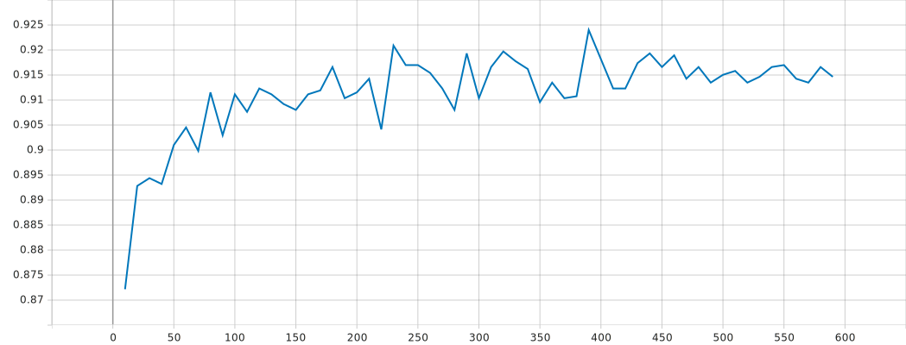

# PointNeXt with pure python

---

## 简介

本项目为PointNeXt复现，原论文地址：[[arXiv]](https://arxiv.org/abs/2206.04670)  
基本环境：Python 3.8 + PyTorch 1.12.1  
> ModelNet40点云分类任务的测试精度
> 
> 

### 与官方源码的区别
- 重构了整体框架，重写了所有代码，去除部分可选参数，更加轻量、易读、易修改
- 代码100%由python编写，无需编译cuda算子，兼容性更强但推理速度有所下降
- group方法由ball-query改为ball-query + KNN的混合query方式

---

## 使用方法

### 训练与测试
1. 训练 `python main.py --gpu_index 0`
2. 测试 `python main.py --gpu_index 0 --mode test --checkpoint PATH/TO/YOUR/CHECKPOINT`

### Tensorboard
1. 控制台执行`tensorboard --logdir=runs --port 6006`  
2. 浏览器访问`http://localhost:6006`

